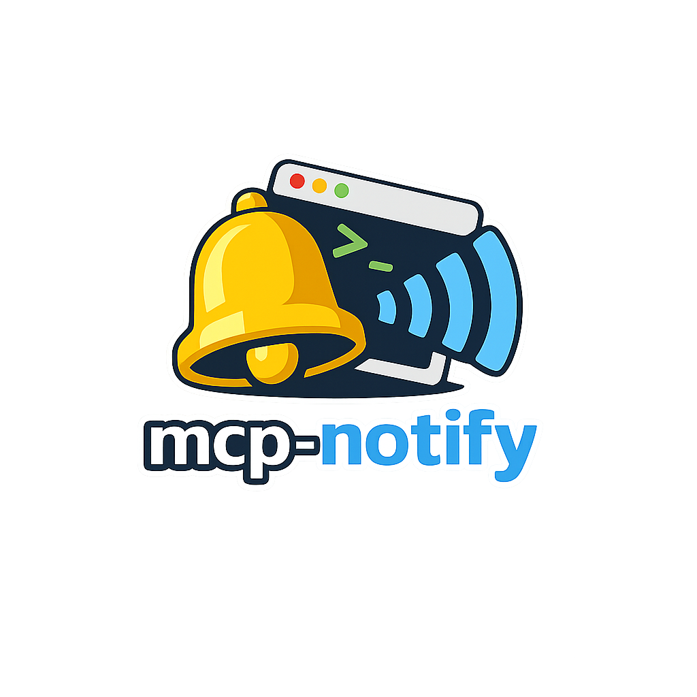

<p align="center">
  
</p>

# mcp-notify

`mcp-notify` is a stdio-based MCP server written in Go that plays a local notification sound on the current machine.

Call the MCP tool `play_mcp_notification_sound` to play either the file configured at server startup or a file selected at call time.

Japanese documentation is available in [README.ja.md](README.ja.md).

## Background

In MCP-based workflows, it is easy to miss tool results or moments when the process is waiting for user confirmation, and only notice later that work has stopped.

This is especially noticeable in asynchronous environments, where you otherwise need to keep watching the screen to notice state changes.

The root problem is relying only on visual feedback. A more direct and intuitive signal helps reduce that monitoring burden.

`mcp-notify` was built to address that gap by turning state changes into audible notifications.

When its MCP tool is called, it plays a local sound on the current machine so MCP-based workflows are easier to notice without constant visual attention.

As a side effect, your workspace may become slightly noisier. Whether that happens depends on how often you call the tool.

## What It Does

- Provides one MCP tool: `play_mcp_notification_sound`
- Plays a sound file under the local `sounds/` directory
- Supports `.wav` and `.mp3`
- Works primarily on Windows, with macOS and Linux support
- Can also run as a one-shot CLI for hook-style integrations

## Quick Start

### 1. Build

```powershell
go build -o .\bin\mcp-notify.exe .\cmd\mcp-notify
```

If you want to verify the repository before wiring it into an MCP client:

```powershell
go test ./...
```

### 2. Configure your MCP client

Example `mcpServers` entry:

```json
{
  "mcpServers": {
    "notify": {
      "command": "C:\\path\\to\\mcp-notify\\bin\\mcp-notify.exe",
      "args": ["--sound", "complete.wav"],
      "cwd": "C:\\path\\to\\mcp-notify"
    }
  }
}
```

If you want asynchronous playback:

```json
{
  "mcpServers": {
    "notify": {
      "command": "C:\\path\\to\\mcp-notify\\bin\\mcp-notify.exe",
      "args": ["--sound", "alerts/sample.mp3", "--wait=false"],
      "cwd": "C:\\path\\to\\mcp-notify"
    }
  }
}
```

If you want to launch it with `go run` instead of building:

```json
{
  "mcpServers": {
    "notify": {
      "command": "go",
      "args": ["run", "./cmd/mcp-notify", "--sound", "complete.wav"],
      "cwd": "C:\\path\\to\\mcp-notify"
    }
  }
}
```

If you want to use it from a short-lived hook without keeping an MCP server alive:

```powershell
.\bin\mcp-notify.exe --play-once complete.wav --wait=false
```

This only registers the MCP server. To actually hear notifications, your MCP client also needs a rule or hook that invokes this server registration at the right moments. Depending on the client, that may mean calling the server via its registration name and then invoking the exposed tool, whose name is normally `play_mcp_notification_sound` but changes if you use `--tool-prefix`.

With Codex, for example, you can express that behavior in `AGENTS.md`. Replace `next-step-call` and `complete-call` below with the MCP registration names you actually use in your environment.

```md
## Task Transition Rules
- When a task (issue) is completed, and the next task is started within the same session, you MUST call the `<your-next-step-mcp-registration>` MCP.
- This applies even if the next task is implicitly continued without explicit user instruction.

## MCP Execution (Critical)
- At the end of EVERY work turn, you MUST call the `<your-complete-mcp-registration>` MCP.
```

## Multiple Server Registrations

You can register the same binary multiple times in your MCP client and split behavior by startup arguments.

Example:

```toml
[mcp_servers.next-step-call]
command = "C:\\mcp\\mcp-notify\\mcp-notify.exe"
args = ["--sound", "alerts/sample.mp3", "--wait=false", "--server-name", "notify-next-step", "--tool-prefix", "next_"]
enabled = true

[mcp_servers.complete-call]
command = "C:\\mcp\\mcp-notify\\mcp-notify.exe"
args = ["--sound", "complete.wav", "--wait=false", "--server-name", "notify-complete", "--tool-prefix", "complete_"]
enabled = true
```

In that setup:

- `next-step-call` and `complete-call` are client-side server registration names
- each server can expose a distinct `serverInfo.name` via `--server-name`
- each server can expose a distinct tool name via `--tool-prefix`
- the actual sound changes because each server starts with a different `--sound` value

This means you can keep one binary while still distinguishing instances in both initialize metadata and tool names.

### 3. Call the tool

Tool name:

```text
play_mcp_notification_sound
```

With `--tool-prefix complete_`:

```text
complete_play_mcp_notification_sound
```

Input examples:

```json
{}
```

```json
{
  "soundPath": "alerts/sample.mp3",
  "wait": false
}
```

Successful response example:

```json
{
  "success": true,
  "soundPath": "C:\\path\\to\\mcp-notify\\sounds\\complete.wav",
  "mode": "sync"
}
```

## Startup Options

- `--sound`: optional relative file name or subpath under `sounds/`
- `--wait`: optional, default `true`
- `--play-once`: optional relative file name or subpath under `sounds/`; plays once and exits instead of starting the MCP server
- `--server-name`: optional, default `mcp-notify`; overrides `initialize.serverInfo.name`
- `--tool-prefix`: optional literal prefix added to `play_mcp_notification_sound`

## Important Behavior

- The tool accepts optional runtime arguments `soundPath` and `wait`
- If `soundPath` is omitted, the startup `--sound` value is used
- Only files under `sounds/` are allowed
- Absolute paths and `..` path traversal are rejected
- `--wait=true` waits for playback to finish
- `--wait=false` returns immediately and keeps playback running in a detached helper process
- Invalid startup configuration causes `initialize` to return an MCP error when `--sound` is set

## Platform Notes

- Windows, macOS, and Linux: uses Go audio playback via `oto` with built-in `.wav` and `.mp3` decoding
- Linux builds require ALSA development headers, for example `libasound2-dev` on Debian/Ubuntu
- Cross-compiling to Linux requires `CGO_ENABLED=1` and the target ALSA libraries to be available

## Limitations

- If you omit both startup `--sound` and tool-call `soundPath`, the tool returns an error
- Replacing the configured sound file with a different sample rate or channel count requires restarting the server

## Docs

- Detailed setup and configuration: [docs/setup.md](docs/setup.md)
- Japanese setup guide: [docs/setup.ja.md](docs/setup.ja.md)
- Development notes: [docs/development.md](docs/development.md)
- Verification memo: [docs/verification.md](docs/verification.md)
- Contribution guide: [CONTRIBUTING.md](CONTRIBUTING.md)
- Japanese contribution guide: [CONTRIBUTING.ja.md](CONTRIBUTING.ja.md)
- Changelog: [CHANGELOG.md](CHANGELOG.md)
- Third-party notices: [THIRD-PARTY-NOTICES.md](THIRD-PARTY-NOTICES.md)
- Release SBOM: bundled as `SBOM.spdx.json` in each release archive (generated by Syft)
- Security policy: [SECURITY.md](SECURITY.md)
- Support policy: [.github/SUPPORT.md](.github/SUPPORT.md)
- Code of Conduct: [CODE_OF_CONDUCT.md](CODE_OF_CONDUCT.md)

Release archives include the linked docs, policy files, and
`THIRD-PARTY-NOTICES.md` above, plus a Syft-generated `SBOM.spdx.json`, so
the bundled README stays self-contained and the shipped contents remain
traceable offline.

## License

MIT. See [LICENSE](LICENSE).
For a reference Japanese translation, see [LICENSE.ja.md](LICENSE.ja.md).
Bundled third-party dependency notices are listed in
[THIRD-PARTY-NOTICES.md](THIRD-PARTY-NOTICES.md).
