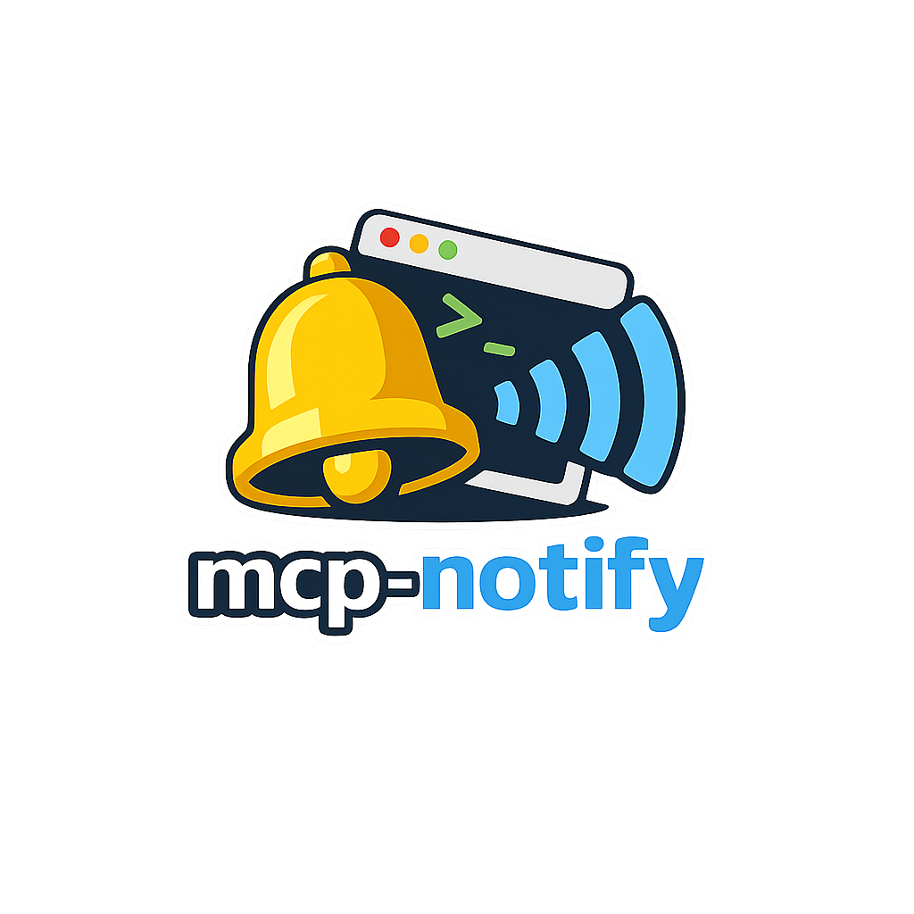

<p align="center">
  
</p>

# mcp-notify

`mcp-notify` is a stdio-based MCP server written in Go that plays local notification sounds and synthesized speech.

Call `play_mcp_notification_sound` to play an audio file. Configure an external VOICEVOX Engine to add `speak_text` to the same MCP server.

Japanese documentation is available in [README.ja.md](README.ja.md).

## Background

In MCP-based workflows, it is easy to miss tool results or moments when the process is waiting for user confirmation, and only notice later that work has stopped.

This is especially noticeable in asynchronous environments, where you otherwise need to keep watching the screen to notice state changes.

The root problem is relying only on visual feedback. A more direct and intuitive signal helps reduce that monitoring burden.

`mcp-notify` was built to address that gap by turning state changes into audible notifications.

When its MCP tool is called, it plays a local sound on the current machine so MCP-based workflows are easier to notice without constant visual attention.

As a side effect, your workspace may become slightly noisier. Whether that happens depends on how often you call the tool.

## What It Does

- Always provides `play_mcp_notification_sound`
- Adds `speak_text` to the same MCP server when VOICEVOX integration is enabled
- Plays a sound file under the local `sounds/` directory
- Supports `.wav` and `.mp3`
- Works primarily on Windows, with macOS and Linux support
- Can also run as a one-shot CLI for hook-style integrations

## Quick Start

### 1. Build

```powershell
go build -o .\bin\mcp-notify.exe .\cmd\mcp-notify
```

If you want to verify the repository before wiring it into an MCP client:

```powershell
go test ./...
```

### 2. Configure your MCP client

Example `mcpServers` entry:

```json
{
  "mcpServers": {
    "notify": {
      "command": "C:\\path\\to\\mcp-notify\\bin\\mcp-notify.exe",
      "args": ["--sound", "complete.wav"],
      "cwd": "C:\\path\\to\\mcp-notify"
    }
  }
}
```

### Use VOICEVOX through the same MCP server

Install VOICEVOX from the [official website](https://voicevox.hiroshiba.jp/), start its Engine, then add the TTS options to the same server registration. The default Engine URL is `http://127.0.0.1:50021`. See the [setup guide](docs/setup.md#installing-voicevox-engine) for desktop, Docker, and standalone Engine options.

```json
{
  "mcpServers": {
    "notify": {
      "command": "C:\\path\\to\\mcp-notify\\bin\\mcp-notify.exe",
      "args": [
        "--sound", "complete.wav",
        "--tts-provider", "voicevox",
        "--voicevox-speaker", "3"
      ],
      "cwd": "C:\\path\\to\\mcp-notify"
    }
  }
}
```

This single registration exposes both `play_mcp_notification_sound` and `speak_text`. VOICEVOX Engine is not bundled with this project.

If you want asynchronous playback:

```json
{
  "mcpServers": {
    "notify": {
      "command": "C:\\path\\to\\mcp-notify\\bin\\mcp-notify.exe",
      "args": ["--sound", "alerts/sample.mp3", "--wait=false"],
      "cwd": "C:\\path\\to\\mcp-notify"
    }
  }
}
```

If you want to launch it with `go run` instead of building:

```json
{
  "mcpServers": {
    "notify": {
      "command": "go",
      "args": ["run", "./cmd/mcp-notify", "--sound", "complete.wav"],
      "cwd": "C:\\path\\to\\mcp-notify"
    }
  }
}
```

If you want to use it from a short-lived hook without keeping an MCP server alive:

```powershell
.\bin\mcp-notify.exe --play-once complete.wav --wait=false
```

This only registers the MCP server. To make speech automatic, also tell the client when to call `speak_text` through its instruction file, custom instructions, rules, or hooks. Speech does not need to be canned: the client can generate a short sentence from the actual result of each turn.

You can use Codex `AGENTS.md`, Claude Code `CLAUDE.md`, or the equivalent MCP and instruction features in another client. See the [MCP client configuration guide](docs/client-configuration.md) for required values, client-specific registration examples, and a client-neutral invocation policy.

## Multiple Server Registrations

You can register the same binary multiple times in your MCP client and split behavior by startup arguments.

The following example uses the Codex TOML format. In another client, add two equivalent entries to its server map.

```toml
[mcp_servers.next-step-call]
command = "C:\\mcp\\mcp-notify\\mcp-notify.exe"
args = ["--sound", "alerts/sample.mp3", "--wait=false", "--server-name", "notify-next-step", "--tool-prefix", "next_"]
enabled = true

[mcp_servers.complete-call]
command = "C:\\mcp\\mcp-notify\\mcp-notify.exe"
args = ["--sound", "complete.wav", "--wait=false", "--server-name", "notify-complete", "--tool-prefix", "complete_"]
enabled = true
```

In that setup:

- `next-step-call` and `complete-call` are client-side server registration names
- each server can expose a distinct `serverInfo.name` via `--server-name`
- each server can expose a distinct tool name via `--tool-prefix`
- the actual sound changes because each server starts with a different `--sound` value

This means you can keep one binary while still distinguishing instances in both initialize metadata and tool names.

### 3. Call the tool

Tool name:

```text
play_mcp_notification_sound
```

With `--tool-prefix complete_`:

```text
complete_play_mcp_notification_sound
```

Input examples:

```json
{}
```

```json
{
  "soundPath": "alerts/sample.mp3",
  "wait": false
}
```

Successful response example:

```json
{
  "success": true,
  "soundPath": "C:\\path\\to\\mcp-notify\\sounds\\complete.wav",
  "mode": "sync"
}
```

Speech example when VOICEVOX integration is enabled:

```json
{
  "text": "The task is complete.",
  "speaker": 3,
  "wait": false,
  "speedScale": 1.1
}
```

`speaker` is a VOICEVOX speaker/style ID. Check `/speakers` on the Engine you run. Omitting `speaker`, `wait`, or the speech controls uses the startup or VOICEVOX query defaults.

## Startup Options

- `--sound`: optional relative file name or subpath under `sounds/`
- `--wait`: optional, default `true`
- `--play-once`: optional relative file name or subpath under `sounds/`; plays once and exits instead of starting the MCP server
- `--server-name`: optional, default `mcp-notify`; overrides `initialize.serverInfo.name`
- `--tool-prefix`: optional literal prefix added to every exposed tool name
- `--tts-provider`: optional; set to `voicevox` to expose `speak_text`
- `--voicevox-url`: optional VOICEVOX Engine base URL; default `http://127.0.0.1:50021`
- `--voicevox-speaker`: optional default speaker/style ID; default `3`

## Important Behavior

- The tool accepts optional runtime arguments `soundPath` and `wait`
- If `soundPath` is omitted, the startup `--sound` value is used
- Only files under `sounds/` are allowed
- Absolute paths and `..` path traversal are rejected
- `--wait=true` waits for playback to finish
- `--wait=false` returns immediately and keeps playback running in a detached helper process
- Invalid startup configuration causes `initialize` to return an MCP error when `--sound` is set
- `speak_text` accepts 1–1000 characters after trimming surrounding whitespace
- With `speak_text`, `wait=false` returns after synthesis completes and continues only playback asynchronously inside the server
- Engine connection or synthesis failures are reported as descriptive `speak_text` tool errors and do not disable the sound tool
- `--tool-prefix` applies to both exposed tool names

## Platform Notes

- Windows, macOS, and Linux: uses Go audio playback via `oto` with built-in `.wav` and `.mp3` decoding
- Linux builds require ALSA development headers, for example `libasound2-dev` on Debian/Ubuntu
- Cross-compiling to Linux requires `CGO_ENABLED=1` and the target ALSA libraries to be available

## Limitations

- If you omit both startup `--sound` and tool-call `soundPath`, the tool returns an error
- Replacing the configured sound file with a different sample rate or channel count requires restarting the server
- VOICEVOX Engine must run as a separate process while using `speak_text`

## VOICEVOX Terms

VOICEVOX Engine is dual-licensed under LGPL v3 and a separate license that does not require source disclosure. See the [official VOICEVOX Engine license](https://github.com/VOICEVOX/voicevox_engine/blob/master/LICENSE) for details.

This project does not bundle, link, or redistribute VOICEVOX Engine, voice libraries, or character assets. It only calls the HTTP API of an Engine started separately by the user, so VOICEVOX Engine is not part of the `mcp-notify` Go dependency graph or release package. Revisit the distribution model and license obligations before bundling any of those components in the future.

Before using or publishing generated audio, review the [VOICEVOX software terms](https://voicevox.hiroshiba.jp/term/) and the terms for each character listed on the [official website](https://voicevox.hiroshiba.jp/). Credit is normally written in the form `VOICEVOX:Character Name`. See the [official Q&A](https://voicevox.hiroshiba.jp/qa/) for placement guidance when audio is played as an announcement or from a device.

## Docs

- MCP client setup and invocation policy: [docs/client-configuration.md](docs/client-configuration.md)
- Japanese client configuration guide: [docs/client-configuration.ja.md](docs/client-configuration.ja.md)
- Detailed setup and configuration: [docs/setup.md](docs/setup.md)
- Japanese setup guide: [docs/setup.ja.md](docs/setup.ja.md)
- Development notes: [docs/development.md](docs/development.md)
- Verification memo: [docs/verification.md](docs/verification.md)
- Contribution guide: [CONTRIBUTING.md](CONTRIBUTING.md)
- Japanese contribution guide: [CONTRIBUTING.ja.md](CONTRIBUTING.ja.md)
- Changelog: [CHANGELOG.md](CHANGELOG.md)
- Third-party notices: [THIRD-PARTY-NOTICES.md](THIRD-PARTY-NOTICES.md)
- Release SBOM: bundled as `SBOM.spdx.json` in each release archive (generated by Syft)
- Security policy: [SECURITY.md](SECURITY.md)
- Support policy: [.github/SUPPORT.md](.github/SUPPORT.md)
- Code of Conduct: [CODE_OF_CONDUCT.md](CODE_OF_CONDUCT.md)

Release archives include the linked docs, policy files, and
`THIRD-PARTY-NOTICES.md` above, plus a Syft-generated `SBOM.spdx.json`, so
the bundled README stays self-contained and the shipped contents remain
traceable offline.

## License

MIT. See [LICENSE](LICENSE).
For a reference Japanese translation, see [LICENSE.ja.md](LICENSE.ja.md).
Bundled third-party dependency notices are listed in
[THIRD-PARTY-NOTICES.md](THIRD-PARTY-NOTICES.md).
